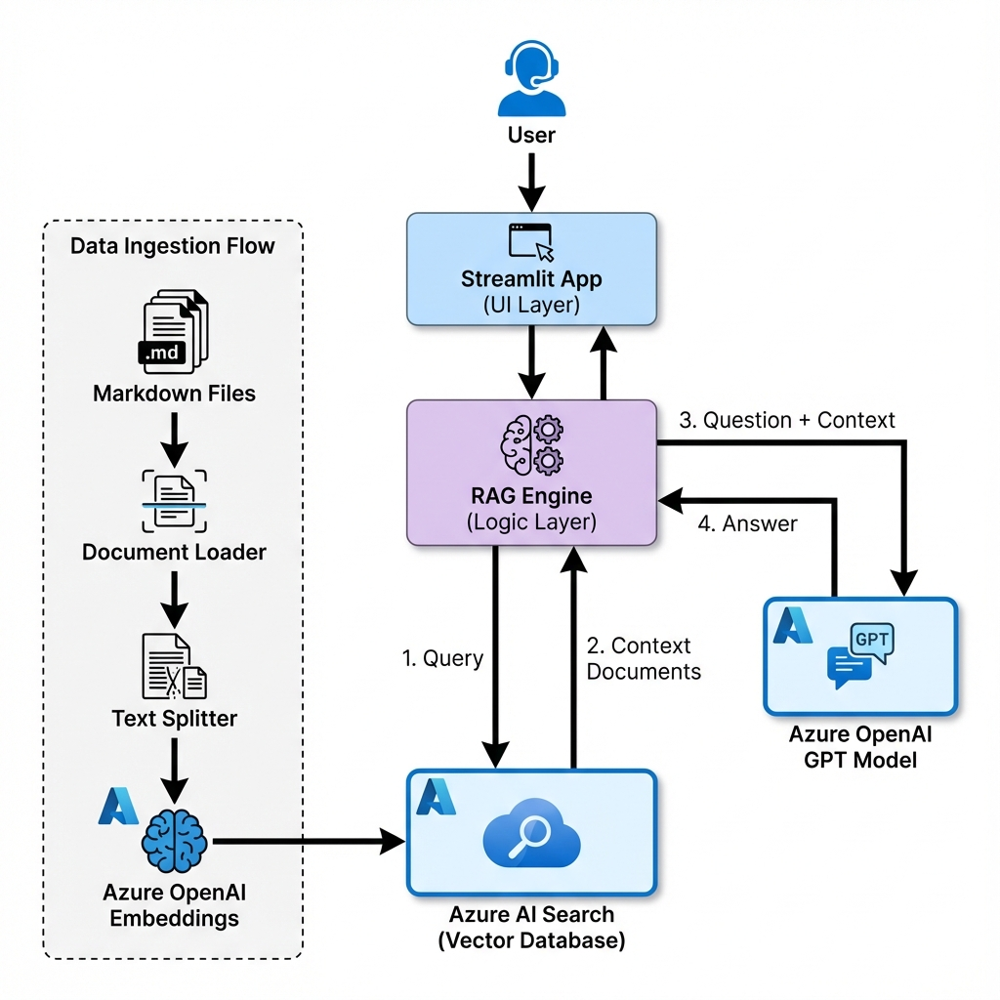

# Azure RAG POC

This project is a Proof of Concept for a Retrieval-Augmented Generation (RAG) application using Azure OpenAI and Azure AI Search.

## Architecture

This application follows a standard RAG architecture pattern using LangChain components.



```mermaid
graph TD
    User[User] -->|Question| App[Streamlit App\n(src/azure_rag_poc/app.py)]
    App -->|Query| RAG[RAG Engine\n(src/azure_rag_poc/rag_engine.py)]
    
    subgraph Data Ingestion
        Docs[Markdown Files\n(data/*.md)] -->|Load| Loader[DirectoryLoader]
        Loader -->|Split| Splitter[RecursiveCharacterTextSplitter]
        Splitter -->|Embed| EmbedModel[Azure OpenAI\nEmbeddings]
        EmbedModel -->|Index| VectorDB[(Azure AI Search)]
    end
    
    subgraph Retrieval & Generation
        RAG -->|Retrieve Context| VectorDB
        VectorDB -->|Context Documents| RAG
        RAG -->|Context + Question| LLM[Azure OpenAI\nGPT Model]
        LLM -->|Answer| App
    end
```

### Components

- **`src/azure_rag_poc/app.py`**: The frontend application built with Streamlit. Handles user input and displays the chat interface.
- **`src/azure_rag_poc/rag_engine.py`**: Core logic module containing:
    - **`load_documents`**: Loads `.md` files from the `data/` directory.
    - **`setup_vectorstore`**: Chunks documents using `RecursiveCharacterTextSplitter` (chunk_size=1000) and indexes them in Azure AI Search.
    - **`get_rag_chain`**: Constructs the LangChain retrieval chain connecting the Vector Store and Azure OpenAI Chat Model.
- **`data/`**: Directory for source documents (Markdown format).

## Setup

1.  **Prerequisites**: Python 3.13+, `uv` installed.
2.  **Install**:
    ```bash
    uv venv
    source .venv/bin/activate
    uv pip install -r requirements.txt
    uv pip install -e .
    ```
3.  **Environment Variables**: Create a `.env` file with the keys listed in `.env.example` (if provided) or based on the code.

## Usage

Run the Streamlit app:
```bash
streamlit run src/azure_rag_poc/app.py
```
